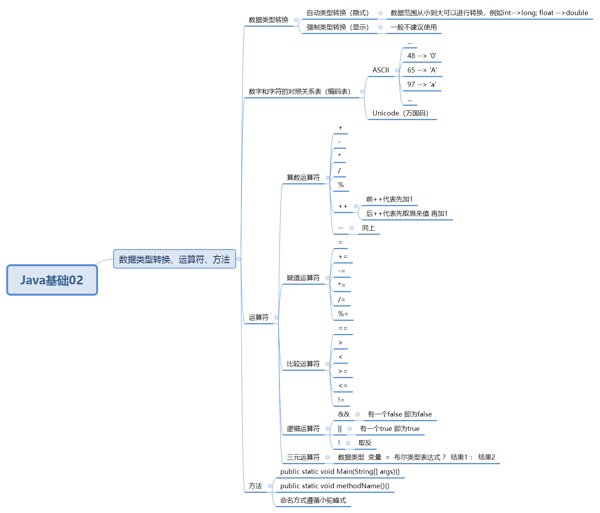

<!--more-->

# 数据类型转换

## 自动类型转换

特点：代码不需要进行特殊处理

规则：数据范围从小到到大，<font color=orange>特指数据类型范围，和数据类型的占用内存范围无关</font>。

## 强制类型转换

一般不建议使用

### 注意事项

- 会造成<font color=red>精度损失</font>>，例如2.5（float）-->2（int），或者<font color=red>数据溢出</font>>；
- byte/short/char都可以进行数据运算，例如“+”
- byte/short/char会提升至int类型进行运算
- 在java中boolean不能够进行任何数据类型转换

### 练习打字中...

自动类型转换

```java
public class Demon01DataType {
    public static void main(String[] args){
        System.out.println(1024); // 整数 默认为int
        System.out.println(3.14); // 浮点数 默认为double

        // 左边是long类型  右边是int类型  左右不一样
        // int --> long, 符合从小到大的规则
        long num1 = 100;
        System.out.println(num1); // 100

        // 左边是double类型  右边是float
        // float --> double, 符合从小到大的规则
        // 4字节 --> 8字节
        double num2 = 2.5F;
        System.out.println(num2);

        // 左边float类型，右边是long类型
        // long -->float，符合从小到大的规则（数据范围）
        // 8字节 -->4字节  也可以实现转换，转换和数据范围有关，和占用内存范围无关
        float num3 = 100L;
        System.out.println(num3);

    }
}
```

强制类型转换

```java
public class Demon02DataType{
    public static void main(String[] args){
        int num1 = (int) 100L;
        System.out.println(num1);

        // long强制转换成int类型
        int num2 = (int) 60000000000L;
        System.out.println(num2);

        // double -->int 强制类型转换
        int num3 = (int) 3.99;
        System.out.println(num3);

        char zifu1 = 'A';
        System.out.println(zifu1+1);

        byte num4 = 40;
        byte num5 = 50;

        // byte +byte --> int + int
        int result1 = num4 +num5;
        System.out.println(result1);

        short num6 = 60;
        // byte + short --> int +int --> int
        //int 强制转换成short: 注意必须保证逻辑上真实大小
        short result2 = (short) (num4 + num6);
    }
}
```

# 运算符

## 加减乘除

> 四则运算当中的加号“+”有常见的三种用法
>
> - 对于数值来说，那就是加法
> - 对于字符char类型来说，计算之前会被提升成int，然后再计算
> - 对于字符串String（首字母大写，并不是关键字）来说，加号代表字符串连接操作

```java
public class Demon04Operator{
    public static void main(String[] args){
        // 两个常量之间也可以进行数学运算
        System.out.println(20+30);

        // 两个变量之间也可以进行数学运算
        int a = 10;
        int b = 20;
        System.out.println(a+b);

        // 变量和常量之间可以混合使用
        System.out.println(a+10);

        int x = 10;
        int y =3;
        int result1 = x / y;
        System.out.println(result1);

        int result2 = x % y;
        System.out.println(result2); // 余数 模：1

        // int + double --> double + double --> double
        double result3 = x + 2.5;
        System.out.println(result3); // 12.5
    }
}
```

```java
public class Demon05Plus{
    public static void main(String[] args){
        String str1 = "Hello";
        System.out.println(str1);

        System.out.println(str1+"World");

        String str2 = "JAVA";
        // String + int --> String
        System.out.println(str2 + 20);

        // 优先级问题
        // String + int + int
        // String       + int
        // String
        System.out.println(str2 + 20 + 30);
        System.out.println(str2 + (20 + 30));
    }
}
```

## 自增自减

> 前++（前--）：直接在原有基础上加（减）1
>
> 后++（后--）：先取原有值，再加（减）1

```java
public class Demon06Operator{
    public static void main(String[] args){
        int num1 = 10;
        System.out.println(num1);

        // 与打印混合使用的时候
        int num2 = 20;
        // 混合使用，先++，变量立刻马上变成21，然后打印输出21
        ++num2;
        System.out.println(num2); // 21
        System.out.println("======================");

        int num3 = 30;
        // 混合使用，后++，首先使用变量本来的30，然后让变量+1得到31
        System.out.println(num3++); // 30
        System.out.println(num3);// 31
        System.out.println("======================");

        int num4 = 40;
        // 混合使用，先——，直接将num4
        System.out.println(--num4);
        System.out.println("======================");

        int num5 = 50;
        num5++;
        System.out.println(num5++); // 51
        System.out.println(num5); // 52
        System.out.println("======================");

        int x = 10;
        int y = 20;
        int result1 = ++x + y--; // 实际写代码一般不这么写，要简单明了
        System.out.println(result1); // 11 + 20 = 31
        System.out.println(x); // 11
        System.out.println(y); // 19

        // 常量不可++，不可--
        // System.out.println(60++);
    }
}
```

## 赋值

```java
//最简单的赋值
=
//复合赋值
+=      a +=1       a = a + 1
-=      b -=1       b = a - 1
*/      c *=5       c = c * 5
/=      d /=6       d = d / 6
%=      e %=7       e = e % 7
```

## 比较

可输出boolean类型

```java
==
<
> 
<=
>=
!=
```

## 逻辑

> 与（并且）  && 全都是 true  才是true  否则就是false
>
> 或（或者）  || 至少是一个true  才是true  全是false 才是false
>
> 非（取反）  ！本来是true  变成false

与 &&  或 ||具有<font color=red>短路效果</font>，如果根据左边就可以判断出最终结果，那么右边的代码将不再执行，从而节省一定的性能

```java
public class Demon09Logic{
    public static void main(String[] args){
        int a = 10;
        System.out.println(3>4 && ++a < 100);
        System.out.println(a); // 显示为10，未进行自增操作
    }
}
```

## 三元

> 一元运算符：只需要一个数据就可以进行操作的运算符，例如：取反！自增++ 自减--
>
> 二元运算符：需要两个数据才可以操作的运算符，例如：加法+  赋值=
>
> 三元运算符：需要三个数据才可以操作的运算符

### 注意事项

必须同时保证表达式A和表达式B都符合左侧数据类型的要求

三元运算符的结果必须被使用

```java
public class Demon10Operator{
    public static void main(String[] args){
        int a = 10;
        int b = 20;

        // 数据类型  变量名称 = 条件判断 ？ 表达式A ： 表达式B
        // 判断a>b是否成立，如果成立将a赋值给max，如果不成立将b赋值给b
        int max = a > b ? a : b;
        System.out.println("最大值："+max); // 20

        // int result = 3 > 4 ? 2.5 : 10; 错误写法
        System.out.println("最大值："+(a > b ? a : b)); // 正确写法
    }
}
```

## 方法

### 注意事项

- 方法定义的先后顺序无所谓
- 方法的定义不能产生嵌套包含关系
- 方法定义好了之后，不会执行的，如果要执行，一定要进行方法的【调用】

```java
public class Demon11Method{
    public static void main(String[] args){
        // 调用农民伯伯的方法
        farmer();

        // 调用小商贩的方法
        seller();

        // 调用厨子的方法
        cook();

        // 调用我的方法
        me();

    }
    public static void farmer(){
        // 农民伯伯
        System.out.println("播种");
        System.out.println("浇水");
        System.out.println("除虫");
        System.out.println("收割");
        System.out.println("卖给小商贩");
    }

    public static void seller(){
        //小商贩
        System.out.println("运输到农贸市场");
        System.out.println("抬高价格");
        System.out.println("吆喝");
        System.out.println("装盘");
    }

    public static void cook(){
        //厨子
        System.out.println("洗菜");
        System.out.println("切菜");
        System.out.println("炒菜");
        System.out.println("装盘");
    }

    public static void me(){
        System.out.println("吃");
    }
}
```